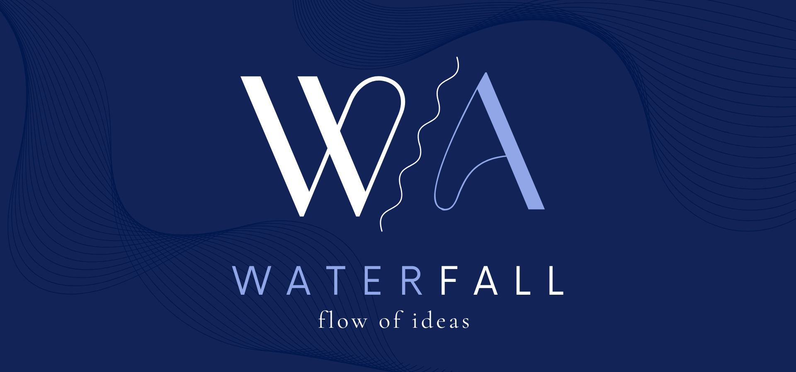

 

# Waterfall Software Solutions

Welcome to the Waterfall Software Solutions GitHub Profile!

## About Us
At Waterfall Software Solutions, we specialize in developing high-quality institutional software solutions tailored to meet the unique needs of our clients. With a focus on efficiency, reliability, and user experience, we aim to empower institutions with cutting-edge technology to streamline their operations and achieve their goals.

_🛠️ Stay tuned for BearSystem._

